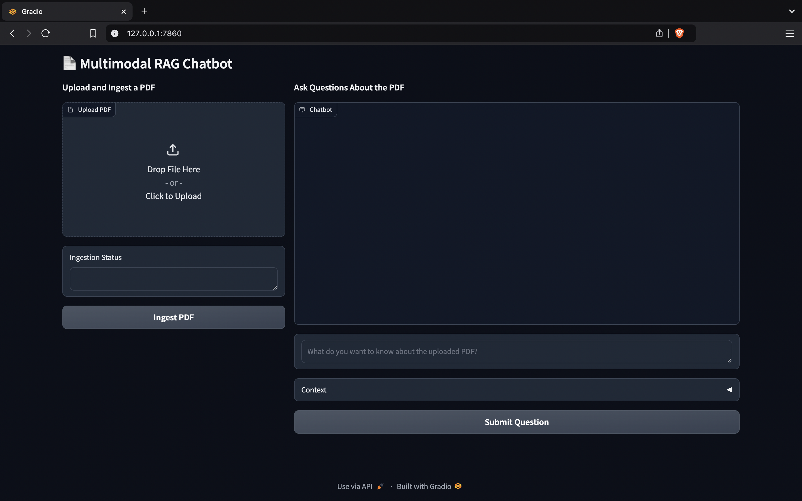
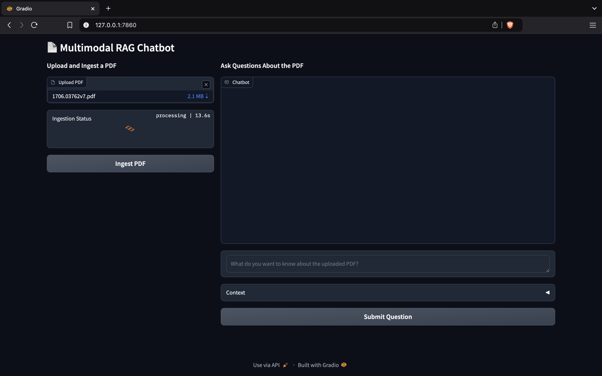
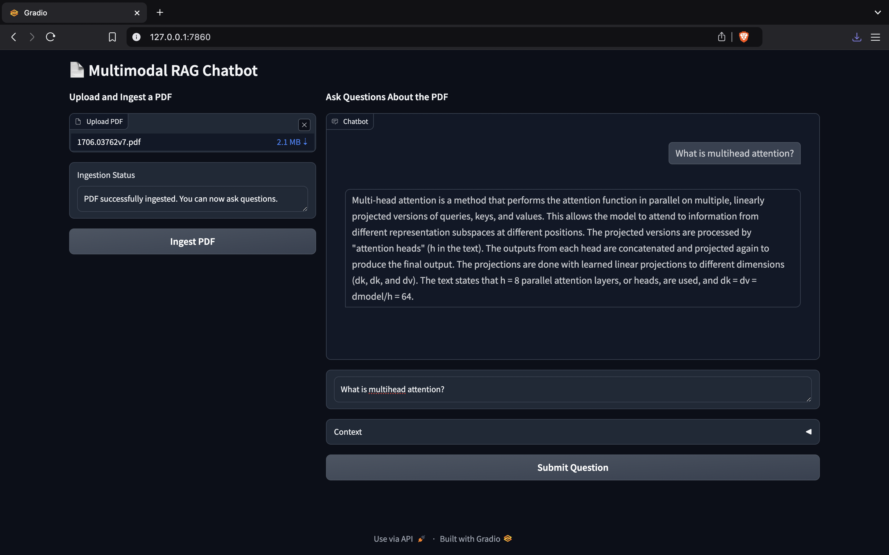
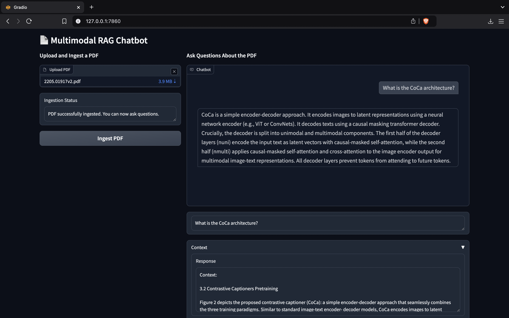
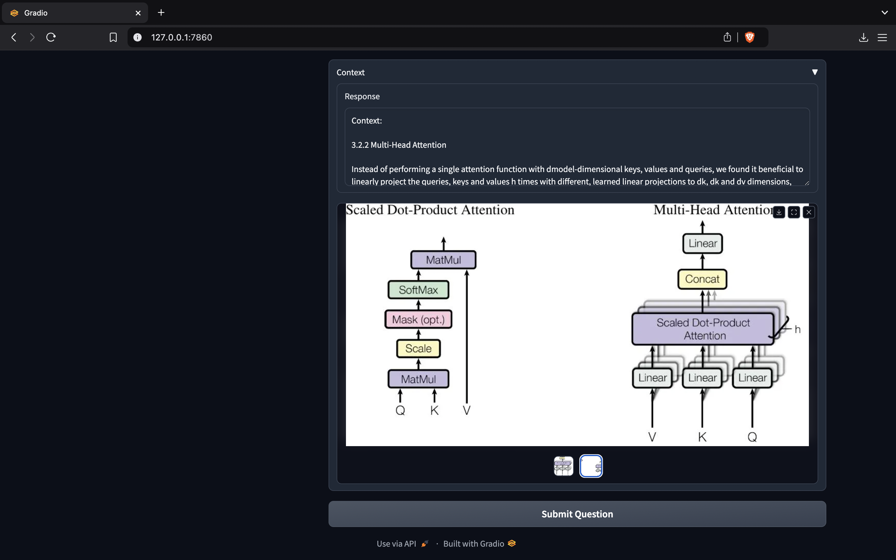
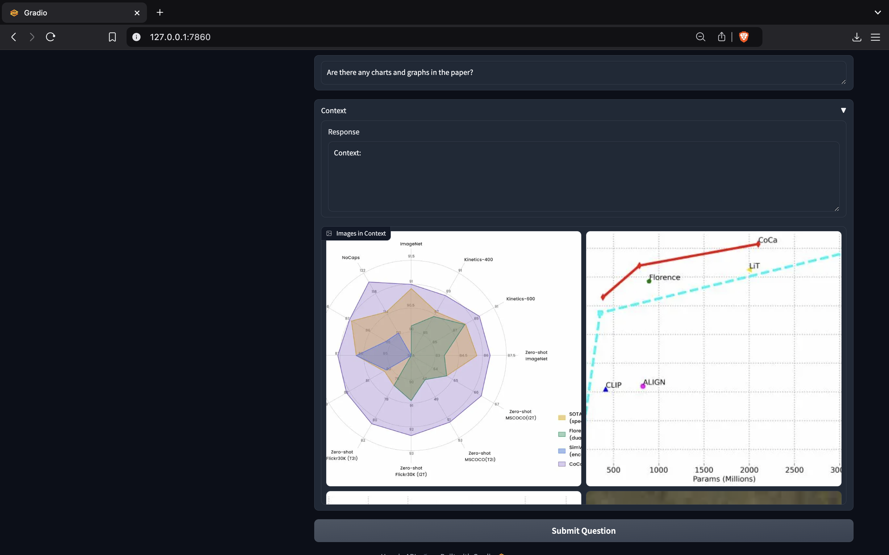
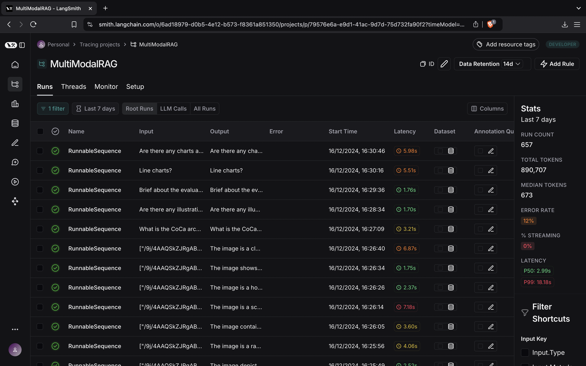
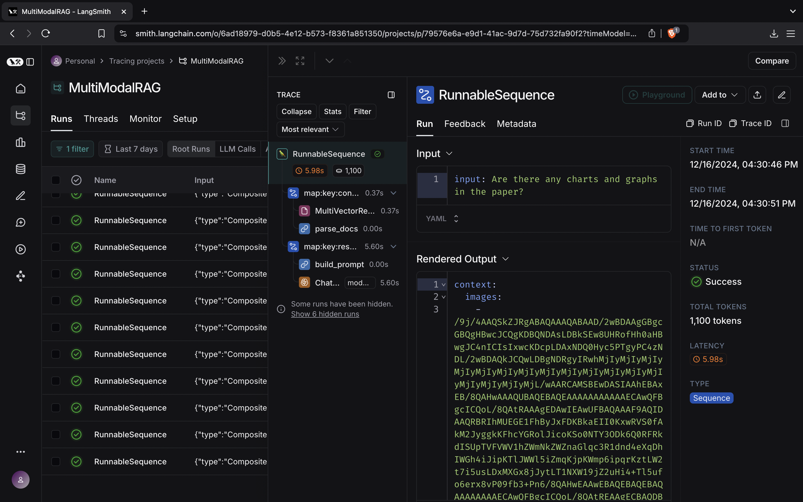

# **RAG Suite: Multimodal, Agentic, and Graph-Based Retrieval-Augmented Generation**

## **Overview**
This repository focuses on the development of three distinct types of Retrieval-Augmented Generation (RAG) systems, designed to explore and push the boundaries of retrieval-augmented AI. These systems enhance language model capabilities by integrating efficient retrieval mechanisms with generative models.

### **Current Progress**
- **Multimodal RAG**: ✅ **Completed**
  - Combines textual and visual data for retrieval and generation.
  - Example Use Case: Extracting information from documents with mixed content such as text, images, and tables.
  
- **Agentic RAG**: 🚧 **Work in Progress**
  - Introduces agent-like behavior for decision-making and task execution.
  - Planned Use Case: Autonomous EDA (Exploratory Data Analysis) and predictive model generation for datasets.

- **Graph-Based RAG**: 🚧 **Work in Progress**
  - Incorporates graph-based data structures for entity-centric retrieval.
  - Planned Use Case: Knowledge graph-based question answering and entity relationship search.

# **Multimodal RAG**

## **Overview**
The **Multimodal Retrieval-Augmented Generation (RAG)** system combines retrieval and generation capabilities to process and generate insights from complex, multi-format data such as PDFs containing text, images, and tables.

## **Tech Stack**
- **Unstructured**: For PDF parsing and data extraction.
- **LangChain**: To build the retrieval and generation pipeline.
- **Google Gemini API**: For summarisation and response generation for user queries.
- **HuggingFace**: Embedding model for semantic search.
- **ChromaDB**: Vector database for similarity-based retrieval.
- **Gradio**: Interactive user interface for uploading PDFs and viewing results.
- **LangSmith**: For tracing and observability.

## **How It Works**
1. **PDF Upload**: Users upload a PDF through the Gradio interface.
2. **Parsing**: The **Unstructured** library extracts text, images, and tables from the document.
3. **Summarising**: The text and tables are summarised and the images are described using the LLM.
4. **Embedding Generation**: Text embeddings for the summaries and the descriptions are generated using the embedding model.
5. **Storing**: The original chunks are stored in the Document Store and the summarised chunks are stored in the Vector DB, with the same UUID.
6. **Vector Search**: The data is retrieved using semantic search for the user query. 
7. **Retrieval & Generation**: Relevant sections of the PDF are retrieved and processed by **LangChain** using the **Google Gemini API** for contextual responses.
8. **Output**: Results are displayed interactively through the Gradio UI.

## **Gallery**
### 1. Gradio UI

### 2. Ingest PDF

### 3. Queries

   
### 4. Context and Images

### 5. Image Query

   
### 6. LangSmith Traces

    
